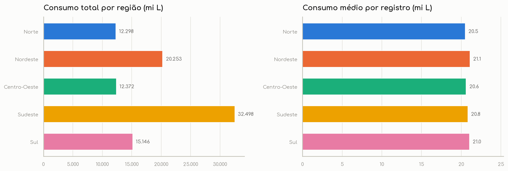
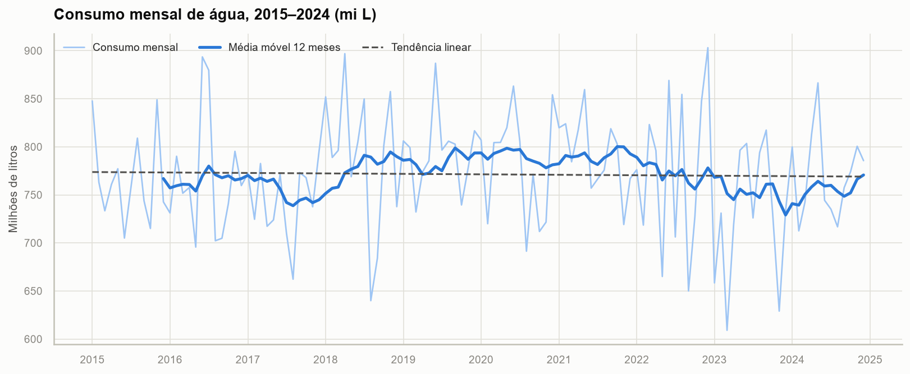
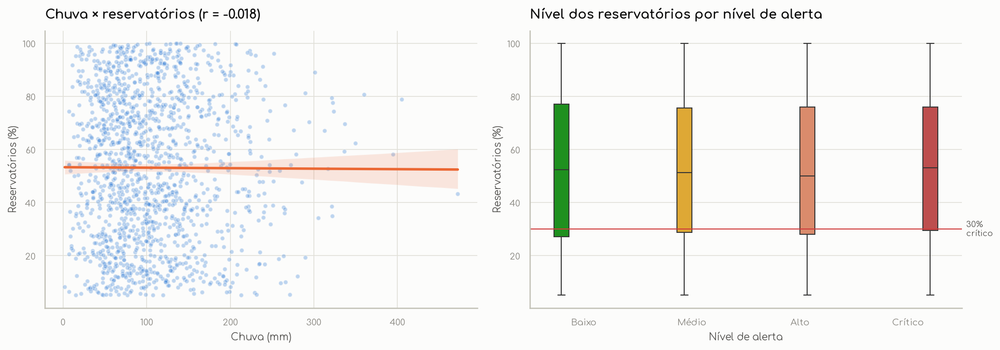

# 💧 Consumo de Água no Brasil: análise e dashboard interativo

Projeto de análise e visualização de dados sobre **consumo, desperdício e segurança hídrica** em 20 estados brasileiros e
5 setores de consumo (2015–2024), desenvolvido em Python para a disciplina **Linguagens de Programação** do curso de
**Sistemas de Informação**.

| Entrega | Link |
|---|---|
| 📄 Página do projeto (GitHub Pages) | https://erickribeirog.github.io/Water-consumption-analysis/ |
| 📊 Dashboard (Streamlit Community Cloud) | https://consumo-agua-br-m2okw6bzzwja2rztjwjzfe.streamlit.app |
| 📓 Notebook de análise | [`notebooks/analise_consumo_agua.ipynb`](notebooks/analise_consumo_agua.ipynb) |
| 🐍 Código do dashboard | [`app.py`](app.py) + [`paginas/`](paginas/) + [`utils/`](utils/) |

---

## 1. Problema

A gestão da água precisa equilibrar **demanda**, **perdas na distribuição** e **disponibilidade dos reservatórios**.
O projeto responde a seis perguntas de negócio:

1. Onde e em que setor se concentra o consumo?
2. Qual o tamanho do desperdício e onde ele é mais grave?
3. Como estão os reservatórios e com que frequência ocorrem alertas elevados?
4. Existe tendência ou sazonalidade no consumo?
5. Chuva e temperatura explicam o consumo e os reservatórios?
6. Os dados são coerentes entre si e com fontes oficiais?

## 2. Base de dados

`dados/simulacao_consumo_agua_brasil.csv`: **4.440 registros mensais** (37 por mês, jan/2015 a dez/2024), 14 colunas.
É uma base **simulada** fornecida pelo professor.

| Coluna | Descrição |
|---|---|
| `ano`, `mes`, `data` | Período de referência |
| `regiao`, `uf` | Região e estado (20 das 27 UFs) |
| `setor_consumo` | Residencial, Comercial, Industrial, Agrícola, Público |
| `consumo_milhoes_litros` | Volume consumido no mês |
| `desperdicio_percentual` | % do volume perdido |
| `reservatorios_percentual` | Nível dos reservatórios (% da capacidade) |
| `chuva_mm`, `temperatura_media` | Variáveis climáticas |
| `populacao`, `consumo_per_capita` | População atendida e consumo por habitante (L/hab/dia) |
| `nivel_alerta` | Baixo, Médio, Alto, Crítico |

**Fontes complementares (APIs públicas do IBGE, via `requests`):**
- [Localidades](https://servicodados.ibge.gov.br/api/docs/localidades): nomes oficiais e regiões das UFs;
- [Malhas](https://servicodados.ibge.gov.br/api/docs/malhas): GeoJSON das UFs para o mapa;
- [Agregados/SIDRA, tabela 6579](https://servicodados.ibge.gov.br/api/docs/agregados): estimativa de população por UF (2021).

As respostas ficam em cache em `dados/ibge/`, então o dashboard funciona mesmo se a API estiver fora do ar.

## 3. Tecnologias

**Obrigatórias:** Python · Pandas · Matplotlib · Seaborn · Streamlit · GitHub
**Complementares:** NumPy · Plotly · SQLAlchemy · SQLite · Requests · Jupyter
**Identidade visual:** fonte [Comfortaa](https://fonts.google.com/specimen/Comfortaa) (licença OFL) no dashboard, nos gráficos e na página do projeto, com **tema claro e escuro**

## 4. Funcionalidades

### Intermediárias
- [x] Filtros múltiplos (período, região, UF dependente da região, setor, nível de alerta), aplicados a todas as páginas
- [x] KPIs dinâmicos com variação em relação ao ano anterior
- [x] Gráficos interativos (Plotly)
- [x] Análise temporal (média móvel, variação anual, tendência, sazonalidade)
- [x] Tratamento avançado de dados (validação de esquema e domínio, outliers por IQR, categorias ordenadas)
- [x] Integração entre tabelas (JOINs no modelo relacional)
- [x] Upload de arquivos CSV com validação
- [x] Dashboard organizado em seções e abas
- [x] Visualizações comparativas (regiões, setores, base × IBGE)
- [x] Análise geográfica (mapa por UF)

### Avançadas
| Funcionalidade | Implementação |
|---|---|
| Consumo de API | `utils/api_ibge.py`: Requests + cache local |
| Persistência em banco | `utils/banco.py`: SQLAlchemy ORM → `database/agua.db` |
| Modelagem relacional | Esquema estrela: `regioes`, `estados`, `setores`, `niveis_alerta`, `medicoes` |
| Dashboard multipágina | `st.navigation` com 6 páginas em `paginas/` |
| Atualização dinâmica | Botão "Atualizar dados do IBGE" na página do mapa |
| Mapas interativos | Coroplético Plotly com GeoJSON oficial do IBGE |
| Séries temporais avançadas | Média móvel 12m, variação anual, regressão linear (NumPy) |
| Correlação estatística | Pearson/Spearman, p-valor, limiar de significância |
| Integração de múltiplas fontes | CSV + API do IBGE + banco SQLite |

## 5. Estrutura do projeto

```
├── app.py                  # entrada do Streamlit: navegação, upload e filtros globais
├── paginas/
│   ├── visao_geral.py      # problema, KPIs, região/setor, alertas, ranking, conclusão executiva
│   ├── analise_temporal.py # série, tendência, variação anual, heatmap, sazonalidade
│   ├── mapa.py             # mapa por UF + comparação com população do IBGE
│   ├── correlacoes.py      # matriz de correlação, dispersão, alerta × reservatório
│   ├── dados_banco.py      # tratamento, auditoria, diagrama relacional, SQL, download
│   └── conclusoes.py       # achados, recomendações e limitações
├── utils/
│   ├── dados.py            # leitura, limpeza, validação, atributos, KPIs
│   ├── banco.py            # modelos SQLAlchemy, criação e consultas ao SQLite
│   ├── api_ibge.py         # cliente das APIs do IBGE com cache
│   ├── estilo.py           # paleta e tema para Matplotlib/Seaborn/Plotly
│   └── app_comum.py        # cache, filtros e componentes compartilhados
├── dados/                  # CSV original + cache JSON/GeoJSON do IBGE
├── database/agua.db        # banco SQLite gerado
├── notebooks/              # analise_consumo_agua.ipynb
├── imagens/                # gráficos exportados pelo notebook (tema claro)
│   └── dark/               # mesmos gráficos no tema escuro (usados pelo index.html)
├── fontes/                 # Comfortaa (.ttf + licença OFL) usada nos gráficos Matplotlib
├── .streamlit/config.toml  # tema do dashboard
├── index.html              # página de apresentação (GitHub Pages)
├── requirements.txt
└── README.md
```

## 6. Como executar localmente

```bash
# 1. Criar e ativar o ambiente virtual
python -m venv .venv
# Windows (PowerShell)
.venv\Scripts\Activate.ps1
# Linux/macOS
source .venv/bin/activate

# 2. Instalar as dependências
pip install -r requirements.txt
pip install jupyter            # opcional, para abrir o notebook

# 3. (Opcional) Recriar o banco SQLite a partir do CSV + IBGE
python -m utils.banco

# 4. Rodar o dashboard
streamlit run app.py
```

O notebook pode ser aberto com `jupyter notebook notebooks/analise_consumo_agua.ipynb`. Ele já está salvo com todas as
saídas.

### Tema claro e escuro
- **Dashboard:** segue o tema do sistema operacional. Também é possível escolher em **⋮ → Light / Dark / System**.
  Os gráficos Plotly trocam de tema na hora. Os gráficos Matplotlib/Seaborn são redesenhados na interação seguinte,
  porque o Streamlit só informa o tema ao Python quando o script é reexecutado.
- **Página do projeto (`index.html`):** segue o sistema. O botão ☾/☀ no menu fixa a escolha, que fica salva no navegador.
  As imagens trocam entre `imagens/` e `imagens/dark/`.
- **Regerar as imagens escuras** (depois de alterar o notebook):

  ```bash
  # PowerShell: $env:TEMA_GRAFICOS="dark"   |   bash: export TEMA_GRAFICOS=dark
  jupyter nbconvert --to notebook --execute --output-dir saida_temp notebooks/analise_consumo_agua.ipynb
  # a cópia executada em saida_temp/ pode ser apagada; só as imagens em imagens/dark/ interessam
  ```

## 7. Pipeline de dados

```
CSV bruto → validação de esquema → padronização de textos/tipos → nulos e duplicatas → validação de domínio
         → categorias ordenadas → engenharia de atributos → integração com IBGE → SQLite (modelo estrela)
         → notebook (EDA) e dashboard (Streamlit)
```

**Atributos criados:** `volume_desperdicado_ml`, `consumo_efetivo_ml`, `trimestre`, `ano_mes`, `estacao`,
`periodo_chuvoso`, `faixa_reservatorio`, `score_alerta`, `alerta_elevado`, `reservatorio_critico`, `chuva_outlier`,
`per_capita_recalculado`.

## 8. Principais resultados

| KPI | Valor |
|---|---|
| Consumo total | 92,6 bilhões de L |
| Volume desperdiçado | 27,9 bilhões de L |
| Taxa de desperdício | **30,1%** |
| Nível médio dos reservatórios | 52,2% |
| Registros com reservatório < 30% | 26,8% |
| Registros em alerta Alto/Crítico | 50,7% |
| Tendência do consumo | −0,06% ao ano (estável) |





**Interpretação**
- O **desperdício (~30%)** é o principal problema e é **sistêmico**: varia só cerca de 1 p.p. entre setores e regiões.
- **1 em cada 4 registros** tem reservatório crítico e metade está em alerta elevado.
- O consumo é **estável**, sem tendência nem sazonalidade.
- O total por região reflete o **número de séries** na base. Normalizado por registro, as regiões são equivalentes.
- A **auditoria de consistência** reprovou os 5 testes: chuva não afeta reservatórios, o alerta não segue o reservatório,
  a população não bate com o IBGE e o per capita não fecha com consumo ÷ população. Isso indica uma base **sintética com
  variáveis independentes**.

## 9. Conclusão

O projeto entrega um **pipeline completo e reutilizável** de dados: tratamento, KPIs, análise estatística, banco
relacional, integração com API e dashboard multipágina. As recomendações são: (1) programa estrutural de redução de
perdas, (2) recalcular o nível de alerta com regras objetivas (`faixa_reservatorio`), (3) validar a população com o IBGE
na origem e (4) aplicar o mesmo pipeline a dados oficiais (SNIS/ANA) pelo **upload** do dashboard.

**Autor:** Erick Ribeiro · Sistemas de Informação · Linguagens de Programação
